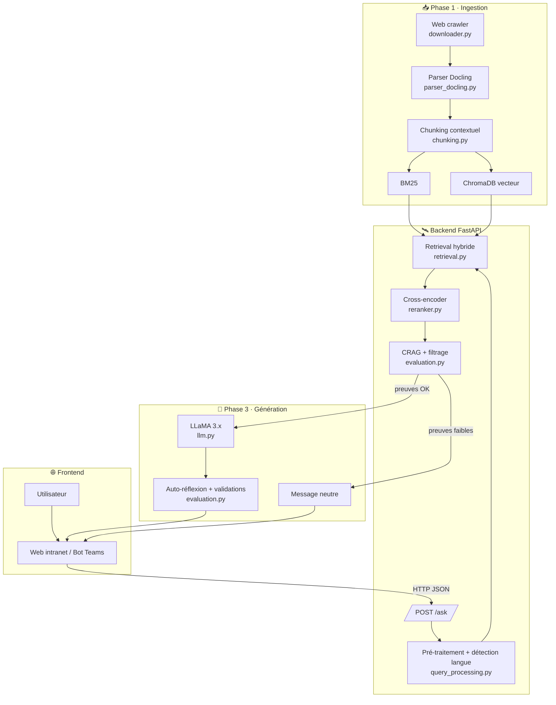

# RAG Formulaire IRCC

<div align="center">

**Système de Recherche Générative Augmentée (RAG) en Français pour les Formulaires IRCC**

[](https://www.python.org/downloads/)
[](https://opensource.org/licenses/MIT)
[](https://github.com/psf/black)

</div>

---

## 📋 Table des Matières

- [Vue d'ensemble](#-vue-densemble)
- [Architecture du Système](#-architecture-du-système)
- [Fonctionnalités Principales](#-fonctionnalités-principales)
- [Installation](#-installation)
- [Guide de Démarrage Rapide](#-guide-de-démarrage-rapide)
- [Configuration](#️-configuration)
- [Utilisation Avancée](#-utilisation-avancée)
- [Structure du Projet](#-structure-du-projet)
- [Tests](#-tests)
- [Limites et Avertissements](#️-limites-et-avertissements)
- [Contribution](#-contribution)

---

## 🎯 Vue d'ensemble

**RAG Formulaire** est une preuve de concept de système RAG (Retrieval-Augmented Generation) conçu pour interroger intelligemment les formulaires d'Immigration, Réfugiés et Citoyenneté Canada (IRCC) en français.

### Architecture monorepo (enterprise-ready)

- **Backend API** : FastAPI dans `backend/` qui enveloppe le module `rag_formulaire` existant.
- **Portail Web** : SPA React/Vite dans `frontend/web-portal` pour l'usage intranet.
- **Bot Teams** : Scaffold Bot Framework dans `frontend/teams-bot` pour Microsoft Teams.
- **Infra & Ops** : Docker, docker-compose et manifests Kubernetes dans `infra/`, scripts d'indexation dans `infra/scripts`.
- **Docs** : Architecture, sécurité et opérations dans `docs/`.

### Démarrage rapide (local)

1. **Construire les index** : `python infra/scripts/init_indexes.py`
2. **API** :
   ```bash
   cd backend
   pip install -r requirements.txt
   uvicorn api.main:app --reload
   ```
3. **Front web** :
   ```bash
   cd frontend/web-portal
   npm install
   npm run dev
   ```
   puis ouvrir http://localhost:5173 (configurer `VITE_API_BASE_URL`).
4. **Stack complète** : `cd infra && docker-compose up --build`

### Tests

- Backend : `PYTHONPATH=backend/src:src pytest backend/tests`
- Front (placeholder lint) : `npm run lint` dans `frontend/web-portal`.

### Cas d'utilisation

- 🔍 **Recherche de formulaires** : "Quel formulaire utiliser pour un permis de travail ?"
- 📝 **Questions spécifiques** : "Quelles informations sont requises dans le formulaire IMM 5476 ?"
- 🎯 **Ciblage précis** : Détection automatique et filtrage par code de formulaire (IMM/CIT)
- 🌐 **Multilingue** : Questions en français ou anglais, réponses toujours en français

### Caractéristiques Techniques

- **Recherche Hybride** : Combine BM25 (lexical) et recherche vectorielle (sémantique)
- **Reranking Cross-Encoder** : Améliore la pertinence des résultats
- **Garde-fous CRAG** : Évaluation de la qualité des preuves avant génération
- **Détection d'Hallucinations** : Validation automatique des codes de formulaire mentionnés
- **Auto-Réflexion Améliorée** : Le LLM critique ses propres réponses avec 4 points de vérification
- **LLM Local** : Llama-3.1-8B-Instruct avec quantification 4-bit sur GPU
- **Parsing Avancé** : Docling avec support OCR pour PDF complexes
- **Singleton Pattern** : Optimisation mémoire GPU (~50% d'économie)
- **Chunks Optimisés** : 400 tokens avec 80 tokens de chevauchement pour meilleur contexte

---

## 🏗️ Architecture du Système

Le pipeline RAG est organisé autour de trois flux connectés : ingestion des données PDF, récupération hybride, puis génération validée par LLaMA. Les interactions front/back sont incluses pour visualiser la chaîne complète.



### Légende des Composants

| Icône | Composant | Description | Module |
|-------|-----------|-------------|--------|
| 🌐 | **Web Crawler** | Télécharge les formulaires IRCC depuis le site officiel | `downloader.py` |
| 📄 | **Parser Docling** | Extraction de texte avec OCR si nécessaire | `parser_docling.py` |
| ✂️ | **Chunking Contextuel** | Découpe intelligente respectant sections/questions | `chunking.py` |
| 📊 | **Index BM25** | Recherche lexicale par mots-clés | `indexing.py` |
| 🧠 | **Index Vectoriel** | Recherche sémantique via embeddings | `indexing.py` |
| 🌍 | **Handler Multilingue** | Normalisation et détection de langue | `query_processing.py` |
| 🎯 | **Routeur Agentique** | Sélection de la stratégie (DIRECT/MULTI_STEP) | `query_processing.py` |
| 🔍 | **Détection Code** | Reconnaissance automatique de codes formulaire (IMM/CIT) | `retrieval.py` |
| 🔀 | **Fusion RRF** | Combinaison des résultats BM25 + vecteurs | `retrieval.py` |
| ⚖️ | **Cross-Encoder Reranker** | Amélioration de la pertinence | `reranker.py` |
| ✅ | **Évaluation CRAG** | Validation de la qualité des preuves | `evaluation.py` |
| 🧠 | **LLM Llama 3.1 8B** | Génération de réponses en français | `llm.py` |
| 🔍 | **Auto-Réflexion** | Vérification de cohérence de la réponse | `evaluation.py` |

---

## ✨ Fonctionnalités Principales

### 🎯 Recherche Intelligente

- **Détection Automatique de Formulaire** : Détecte les codes (IMM 5476, CIT 0002) et filtre les résultats
- **Recherche Hybride** : Combine recherche lexicale (BM25) et sémantique (vecteurs)
- **Reranking Avancé** : Cross-encoder pour améliorer la pertinence
- **Fusion RRF** : Reciprocal Rank Fusion pour combiner les scores

### 🛡️ Garde-fous et Sécurité

- **Évaluation CRAG** : Vérifie la qualité des preuves avant génération
- **Validation de Codes** : Détecte et bloque les hallucinations de codes de formulaire (IMM/CIT)
- **Auto-Réflexion Améliorée** : Critique structurée en 4 points avec détection de 8 mots-clés problématiques
- **Messages de Fallback** : Refuse de répondre si les preuves sont insuffisantes
- **Disclaimer Automatique** : Avertissement légal sur chaque réponse
- **Mode Strict Configurable** : Option de vérification n-gram ultra-stricte

### 🚀 Optimisations Performantes

- **LLM Singleton** : Une seule instance du modèle (économie mémoire ~50%)
- **Quantification 4-bit** : Chargement optimisé sur GPU T4/Tesla
- **Deduplication** : Évite les doublons dans le manifest
- **Chunking Contextuel** : Préserve le contexte avant/après chaque chunk

---

## 📦 Installation

### Prérequis

- Python 3.10 ou supérieur
- GPU avec ≥14 GB VRAM recommandé pour Llama-3.x 8B (T4/A10/A100) ou endpoint TGI/Ollama déjà provisionné
- (Optionnel) Module `bitsandbytes` pour quantification 4-bit
- Token Hugging Face si vous chargez un modèle LLaMA privé (`HF_TOKEN`/`HUGGING_FACE_HUB_TOKEN`)

### Installation Standard

```bash
# Cloner le dépôt
git clone https://github.com/abdelmajidlra/rag-formulaire.git
cd rag-formulaire

# Installer en mode développement
pip install -e .
```

### Installation pour GPU (T4/Colab)

```bash
# Installer avec support quantification
pip install -e .
pip install bitsandbytes
```

### 🦙 Préparer LLaMA (local ou endpoint)

- **Chargement local (par défaut)** : le backend charge `meta-llama/Llama-3.1-8B-Instruct` en 4-bit si une GPU est disponible. Assurez-vous d'avoir au moins ~14 GB de VRAM.
- **Endpoint distant** : définissez `RAG_FORM_GEN_ENDPOINT` vers un service TGI/Ollama (ex: `http://llama:8080`) pour déporter l'inférence. L'API ne chargera pas le modèle localement.
- **Token HF** : exportez `HF_TOKEN` ou `HUGGING_FACE_HUB_TOKEN` pour les modèles gated avant tout `docker-compose` ou lancement local.
- **Tuning** : ajustez `RAG_FORM_GEN_MAX_NEW_TOKENS` pour contrôler la longueur des réponses.

---

## 🚀 Guide de Démarrage Rapide

### 1. Construction de l'Index

```bash
python -m rag_formulaire.ingest
```

**Ce que fait cette commande :**
- Télécharge au moins 30 formulaires IRCC en français
- Parse les PDFs avec Docling (OCR si nécessaire)
- Découpe en chunks contextuels
- Construit les index BM25 et vectoriel
- Génère `data/forms_manifest.json`

**Durée estimée :** 10-15 minutes (selon la connexion)

### 2. Poser des Questions

#### Mode Interactif (CLI)

```bash
python -m rag_formulaire.cli
```

**Exemples de questions :**

```
>>> Quel formulaire utiliser pour un permis de travail ?
>>> À quoi sert le formulaire IMM 5476 ?
>>> Quelles informations sont requises pour la déclaration d'union de fait ?
```

#### Mode Programmatique

```python
from rag_formulaire.cli import answer_question

result = answer_question("Quel formulaire pour un permis de travail ?")
print(result["answer"])
print(result["sources"])
```

### 3. Backend + Frontend avec LLaMA

- **Option 1 · Docker Compose complet (API + LLaMA + Web)**
  ```bash
  cd infra
  export HF_TOKEN=hf_...   # requis pour télécharger le modèle privé
  docker-compose up --build
  ```
  - L'API pointe par défaut vers le service TGI `llama` (`RAG_FORM_GEN_ENDPOINT=http://llama:8080`).
  - Le portail est disponible sur http://localhost:5173 (variable `VITE_API_BASE_URL` injectée par docker-compose).

- **Option 2 · API locale avec endpoint distant**
  ```bash
  export RAG_FORM_GEN_ENDPOINT="http://llama-host:8080"   # TGI/Ollama ou autre
  export HF_TOKEN=hf_...                                    # si le modèle est privé côté endpoint
  cd backend
  pip install -r requirements.txt
  PYTHONPATH=../src uvicorn api.main:app --reload --host 0.0.0.0 --port 8000
  ```
  Puis dans `frontend/web-portal`, configurez `VITE_API_BASE_URL=http://localhost:8000` et lancez `npm run dev`.

---

## ⚙️ Configuration

Les paramètres de configuration se trouvent dans `src/rag_formulaire/config.py`. Vous pouvez les surcharger via des variables d'environnement :

| Variable | Défaut | Description |
|----------|--------|-------------|
| `RAG_FORM_BASE_DIR` | `.` | Répertoire racine pour les données |
| `RAG_FORM_MIN_FORMS` | `40` | Nombre minimum de formulaires à télécharger |
| `RAG_FORM_ENABLE_GRAPHRAG` | `false` | Activer GraphRAG (expérimental) |
| `RAG_FORM_STRICT_VERIFICATION` | `false` | Mode strict : vérification n-gram (peut bloquer réponses valides) |
| `RAG_FORM_CHUNK_SIZE` | `400` | Taille des chunks en tokens |
| `RAG_FORM_CHUNK_OVERLAP` | `80` | Chevauchement entre chunks en tokens |
| `RAG_FORM_GEN_MODEL` | `meta-llama/Llama-3.1-8B-Instruct` | Modèle LLaMA (chargé localement si aucun endpoint n'est fourni) |
| `RAG_FORM_GEN_4BIT` | `true` | Activer la quantification 4-bit lors du chargement local |
| `RAG_FORM_GEN_ENDPOINT` | _vide_ | URL TGI/Ollama pour déléguer la génération LLaMA |
| `RAG_FORM_GEN_MAX_NEW_TOKENS` | `256` | Longueur maximale des réponses générées |

**Exemple de configuration personnalisée :**

```bash
export RAG_FORM_MIN_FORMS=50
export RAG_FORM_BASE_DIR=/data/rag
python -m rag_formulaire.ingest
```

---

## 🔬 Utilisation Avancée

### Notebook LLaMA

- `notebooks/ircc-rag-llama.ipynb` : parcours complet local pour ingestion + retrieval + génération LLaMA 3.x (mode endpoint ou chargement local).
- `notebooks/colab-ircc-rag-poc.ipynb` : variante Colab (GPU T4) pour les essais rapides.

**Étapes clés :**
1. Installer les dépendances (`pip install -e .` + `bitsandbytes` si GPU disponible).
2. Exporter `RAG_FORM_GEN_MODEL`, `RAG_FORM_GEN_ENDPOINT` (si vous utilisez TGI/Ollama) et `HF_TOKEN`/`HUGGING_FACE_HUB_TOKEN` pour les modèles gated.
3. Lancer les cellules d'ingestion, puis les cellules de questions pour valider la génération.

### Intégration dans une Application

```python
from rag_formulaire.indexing import load_indexes
from rag_formulaire.retrieval import HybridRetriever
from rag_formulaire.llm import LocalLLM
from rag_formulaire.evaluation import CRAGEvaluator

# Charger les composants (singleton pour LLM)
index = load_indexes()
retriever = HybridRetriever(index)
llm = LocalLLM()  # Singleton - une seule instance
evaluator = CRAGEvaluator()

# Pipeline complet
def query_pipeline(question: str):
    candidates = retriever.retrieve(question)
    
    if not evaluator.is_evidence_strong([1.0] * len(candidates), candidates):
        return {"answer": evaluator.fallback_message()}
    
    evidence_text = "\n".join([c.base_chunk.content for c in candidates[:5]])
    answer = llm.chat("Réponds en français basé sur ces extraits", evidence_text)
    
    return {"answer": answer, "evidence": candidates[:5]}
```

---

## 📁 Structure du Projet

```
rag-formulaire/
├── src/
│   └── rag_formulaire/
│       ├── __init__.py
│       ├── config.py              # Configuration centralisée
│       ├── downloader.py          # 🌐 Crawler de formulaires IRCC
│       ├── parser_docling.py      # 📄 Parsing PDF avec OCR
│       ├── chunking.py            # ✂️ Découpe contextuelle
│       ├── indexing.py            # 🗂️ Index BM25 + Vecteurs
│       ├── data_models.py         # 📊 Modèles de données
│       ├── query_processing.py    # 🌍 Traitement multilingue
│       ├── retrieval.py           # 🔍 Recherche hybride + filtrage
│       ├── reranker.py            # ⚖️ Cross-encoder reranking
│       ├── evaluation.py          # ✅ CRAG + auto-réflexion
│       ├── llm.py                 # 🧠 LLM Llama (singleton)
│       ├── graph_rag.py           # 🕸️ GraphRAG (expérimental)
│       ├── ingest.py              # 📥 Pipeline d'ingestion
│       └── cli.py                 # 💬 Interface en ligne de commande
├── notebooks/
│   ├── ircc-rag-llama.ipynb      # 📓 Notebook local complet LLaMA
│   └── colab-ircc-rag-poc.ipynb  # 📓 Notebook Colab optimisé
├── tests/                         # 🧪 Tests unitaires
├── data/                          # 📂 Données générées (ignoré par git)
│   ├── raw/forms/                 # PDFs téléchargés
│   ├── index/                     # Index BM25 + ChromaDB
│   └── forms_manifest.json        # Métadonnées des formulaires
├── pyproject.toml                 # 📦 Configuration du projet
└── README.md                      # 📖 Ce fichier
```

---

## 🧪 Tests

Exécutez les tests unitaires et validations principales :

```bash
# Librairie coeur (ingestion/retrieval/génération)
pytest

# API FastAPI
PYTHONPATH=backend/src:src pytest backend/tests

# Portail web
(cd frontend/web-portal && npm run lint)
```

Pensez à régénérer les index (`python -m rag_formulaire.ingest`) avant de lancer des tests qui dépendent des données.

---

## ⚠️ Limites et Avertissements

### Limites Techniques

- **Dépendance Réseau** : Nécessite un accès internet pour télécharger les formulaires IRCC
- **Ressources GPU** : LLM optimisé pour GPU T4 (15GB VRAM), mode CPU disponible mais lent
- **Performance** : Le reranking cross-encoder peut être lent sur CPU (~2-3s par requête)
- **Langue** : Optimisé pour le français, support anglais limité

### Avertissement Légal

> **⚠️ IMPORTANT** : Ce système est une preuve de concept à but informatif uniquement. Les réponses générées **ne constituent pas un avis juridique** ni un conseil en immigration. Veuillez **toujours vérifier les formulaires officiels** sur le site d'IRCC et consulter un professionnel qualifié pour votre situation spécifique.

### Exactitude

- Les réponses sont basées sur le contenu des formulaires PDF téléchargés
- Les formulaires peuvent être obsolètes si IRCC les met à jour
- Le LLM peut générer des erreurs malgré les garde-fous CRAG

---

## 🤝 Contribution

Les contributions sont les bienvenues ! Veuillez suivre ces étapes :

1. **Fork** le projet
2. Créer une branche feature (`git checkout -b feature/amelioration`)
3. Commit vos changements (`git commit -m 'Ajout amelioration'`)
4. Push vers la branche (`git push origin feature/amelioration`)
5. Ouvrir une **Pull Request**

### Guidelines de Contribution

- Suivre le style de code Black (`black .`)
- Ajouter des tests pour les nouvelles fonctionnalités
- Mettre à jour la documentation si nécessaire
- S'assurer que tous les tests passent (`pytest`)

---

## 📄 Licence

Ce projet est sous licence MIT. Voir le fichier `LICENSE` pour plus de détails.

---

## 🙏 Remerciements

- **IRCC** pour la disponibilité publique des formulaires
- **Docling** pour le parsing avancé de PDF
- **ChromaDB** pour le stockage vectoriel
- **HuggingFace** pour les modèles et l'écosystème
- **Meta** pour la famille Llama 3

---

<div align="center">

**Développé avec ❤️ pour faciliter l'accès à l'information sur l'immigration**

[⬆ Retour en haut](#rag-formulaire-ircc)

</div>
