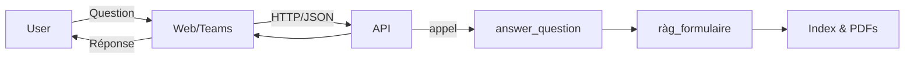

# Architecture

## Contexte

Assistant interne pour formulaires IRCC : un moteur RAG existant (`rag_formulaire`) enrichi par une API FastAPI, un portail web et un bot Teams.

## Couches

- **Front** : SPA React (intranet) + Bot Teams (Bot Framework).
- **API** : FastAPI (`ircc-rag-api`) gère auth, CORS, exposition du pipeline.
- **IA/RAG** : Module Python `rag_formulaire` (retrieval hybride, rerank, génération locale).
- **Données** : PDFs IRCC, index BM25 + vecteurs, stockés localement ou sur PVC.

## Flux

## Déploiement

- Local : `docker-compose` (API + web).
- Prod : manifests Kubernetes (backend, frontend, ingress) + PVC pour les index.
